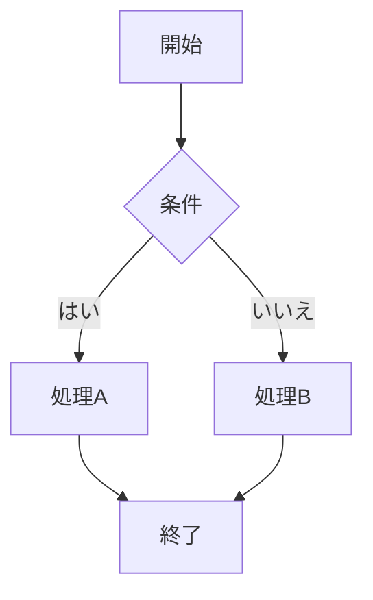

# Obsidian 完全ナレッジベース — 世界最高水準の包括ガイド

---

## 1. Obsidianの基本概要

### 1.1 Obsidianとは
Obsidianはローカルファースト・Markdown対応のナレッジマネジメント（PKM）ツールです。全てのノートはプレーンテキスト（.mdファイル）で保存されるため、ベンダーロックインがなく、データの完全な所有権をユーザーが持ちます。Windows、macOS、Linux、iOS、Androidに対応しています。

### 1.2 主要な特徴
- **ローカルファースト**: データは全てユーザーのデバイスに保存
- **Markdownベース**: 標準的なMarkdown記法で記述
- **双方向リンク**: `[[ノート名]]` でノート間をリンク
- **グラフビュー**: ノート間のつながりを視覚的に可視化
- **プラグインエコシステム**: 2000以上のコミュニティプラグイン
- **テーマカスタマイズ**: 外観を自由に変更可能
- **Canvas**: 無限キャンバスでビジュアルシンキング
- **クロスプラットフォーム**: 全主要OSに対応

### 1.3 Vault（保管庫）の概念
Vaultは1つのフォルダであり、その中にMarkdownファイルと設定ファイルが格納されます。複数のVaultを作成でき、仕事用・個人用・プロジェクト用など目的別に管理できます。

### 1.4 料金体系
- **個人利用**: 無料（コアアプリ＋コミュニティプラグイン）
- **商用利用**: 年$50/ユーザー
- **Obsidian Sync**: $4〜8/月（オプション）
- **Obsidian Publish**: $8〜16/月（オプション）

---

## 2. Markdown記法 完全リファレンス

### 2.1 基本書式
```markdown
# 見出し1
## 見出し2
### 見出し3

**太字テキスト**
*斜体テキスト*
~~取り消し線~~
==ハイライト==（Obsidian拡張）

- 箇条書きリスト
- ネスト可能
  - サブ項目

1. 番号付きリスト
2. 自動的に番号が振られる

> 引用テキスト
> 複数行も可能

`インラインコード`
```

### 2.2 リンクと埋め込み
```markdown
[[内部リンク]]
[[内部リンク|表示テキスト]]
[[内部リンク#見出し]]
![[埋め込みノート]]
![[画像ファイル.png]]
![[画像ファイル.png|300]]  ← サイズ指定
[外部リンク](https://example.com)
```

### 2.3 タスクリスト
```markdown
- [ ] 未完了タスク
- [x] 完了タスク
- [/] 進行中（Tasksプラグイン）
- [-] キャンセル（Tasksプラグイン）
```

### 2.4 テーブル
```markdown
| 列1 | 列2 | 列3 |
|------|------|------|
| A    | B    | C    |
| D    | E    | F    |
```

### 2.5 コールアウト（Obsidian拡張）
```markdown
> [!note] タイトル
> ノートの内容

> [!tip] ヒント
> 便利な情報

> [!warning] 注意
> 注意が必要な情報

> [!danger] 危険
> 重要な警告

> [!example] 例
> 使用例の説明

> [!info]+ 折りたたみ可能（デフォルト展開）
> 内容

> [!info]- 折りたたみ可能（デフォルト折りたたみ）
> 内容
```

利用可能なコールアウトタイプ: note, abstract, info, todo, tip, success, question, warning, failure, danger, bug, example, quote

### 2.6 脚注
```markdown
テキスト中の脚注[^1]

[^1]: 脚注の内容
```

### 2.7 数式（LaTeX）
```markdown
インライン数式: $E = mc^2$

ブロック数式:
$$
\frac{-b \pm \sqrt{b^2 - 4ac}}{2a}
$$
```

### 2.8 Mermaid図
````markdown

````

対応図タイプ: フローチャート、シーケンス図、ガントチャート、クラス図、状態遷移図、ER図、パイチャート、マインドマップ

---

## 3. コアプラグイン（標準搭載）

### 3.1 ファイル関連
- **ファイルエクスプローラー**: Vault内のファイル・フォルダを管理
- **クイックスイッチャー**: `Ctrl/Cmd+O` でファイルを素早く検索・移動
- **ブックマーク**: よく使うノート・検索・見出しをブックマーク
- **テンプレート**: 定型ノートのテンプレートを挿入

### 3.2 エディター関連
- **アウトライン**: 現在のノートの見出し構造を表示
- **ワードカウント**: 文字数・単語数をステータスバーに表示
- **タグペイン**: Vault内のタグ一覧を表示
- **検索**: Vault全体のキーワード検索

### 3.3 ビュー関連
- **グラフビュー**: ノート間のリンク関係を可視化
- **バックリンク**: 現在のノートへのリンク元を表示
- **アウトゴーイングリンク**: 現在のノートからのリンク先を表示
- **ページプレビュー**: リンクにホバーでプレビュー表示

### 3.4 同期・公開
- **Sync**: Obsidian公式の同期サービス
- **Publish**: ノートをWeb上に公開

### 3.5 キャンバス
- **Canvas**: 無限のキャンバスでノートを配置・接続する
- カード（テキスト）、ノートリンク、画像、Webページの埋め込みが可能
- グループ化機能で関連要素をまとめる
- 矢印コネクタでカード間の関係を示す

### 3.6 その他重要なコアプラグイン
- **デイリーノート**: 毎日の日記ノートを自動生成
- **スラッシュコマンド**: `/` で利用できるコマンドメニュー
- **ランダムノート**: ランダムにノートを表示
- **ユニークノートクリエーター**: タイムスタンプ付きのユニークIDノート生成

---

## 4. コミュニティプラグイン 完全ガイド

### 4.1 データ管理・クエリ系

#### Dataview（必須級）
Vault内のデータをデータベースのようにクエリ・集計・表示するプラグイン。

**基本クエリ構文**:
````markdown
```dataview
TABLE file.ctime AS "作成日", tags AS "タグ"
FROM "フォルダ名"
WHERE contains(tags, "#読書")
SORT file.ctime DESC
LIMIT 10
```
````

**リスト表示**:
````markdown
```dataview
LIST
FROM #todo AND -"Archive"
WHERE !completed
SORT priority ASC
```
````

**タスク表示**:
````markdown
```dataview
TASK
FROM "Projects"
WHERE !completed
GROUP BY file.link
```
````

**カレンダー表示**:
````markdown
```dataview
CALENDAR file.ctime
FROM "日記"
```
````

**Dataview JS（上級）**:
````markdown
```dataviewjs
const pages = dv.pages("#プロジェクト")
    .where(p => p.status === "進行中")
    .sort(p => p.priority, "desc");
    
dv.table(
    ["プロジェクト名", "ステータス", "期限"],
    pages.map(p => [p.file.link, p.status, p.deadline])
);
```
````

#### Bases
Markdown ファイルをデータベース的に構造化し、スキーマとプロパティで整理するプラグイン。

#### DB Folder
フォルダをデータベーステーブルとして扱い、Notion風のインターフェースを提供。

### 4.2 テンプレート・自動化系

#### Templater（必須級）
コア「テンプレート」を大幅に拡張。JavaScript実行、カーソル位置制御、フォルダ別テンプレートなど高度な機能。

**基本テンプレート例**:
```markdown
---
created: <% tp.date.now("YYYY-MM-DD HH:mm") %>
tags: 
type: 
---

# <% tp.file.title %>

## 概要

<% tp.file.cursor() %>

## 関連ノート

## 参考資料
```

**高度な例（プロンプト付き）**:
```markdown
<%*
const category = await tp.system.suggester(
    ["読書メモ", "会議メモ", "アイデア", "プロジェクト"],
    ["reading", "meeting", "idea", "project"]
);
const title = await tp.system.prompt("タイトルを入力");
await tp.file.rename(title);
-%>
---
type: <% category %>
created: <% tp.date.now("YYYY-MM-DD") %>
---

# <% title %>
```

#### QuickAdd
カスタムマクロでクイックキャプチャ。日記エントリ、特定テンプレート適用、複数コマンド実行などを自動化。

#### Periodic Notes
デイリーノートを拡張し、週次・月次・四半期・年次ノートも自動生成。

### 4.3 タスク管理系

#### Tasks
Obsidianを高機能タスクマネージャーに変身させるプラグイン。

**機能一覧**:
- 期限日 (`📅 2025-01-15`)
- 予定日 (`⏳ 2025-01-10`)
- 開始日 (`🛫 2025-01-01`)
- 繰り返しタスク (`🔁 every week`)
- 優先度 (`⏫ 高`, `🔼 中`, `🔽 低`)
- カスタムフィルタリング・ソート

**クエリ例**:
````markdown
```tasks
not done
due before tomorrow
sort by priority
group by folder
```
````

#### Kanban
ボード形式でタスクを管理。列（リスト）間でカードをドラッグ＆ドロップ。

#### Day Planner
タイムブロッキングで日次計画を可視化。

### 4.4 ビジュアル・描画系

#### Excalidraw（高推奨）
手書き風のホワイトボード。図解、フローチャート、マインドマップをObsidian内で直接作成。

**主要機能**:
- フリーハンド描画
- 図形・テキスト・矢印ツール
- ノートへのリンク埋め込み
- Markdownとの統合（ノート裏面にExcalidraw描画）
- ライブラリからの素材利用
- SVG/PNGエクスポート

#### Mind Map
マークダウンの見出し構造からマインドマップを自動生成。

#### Diagrams（draw.io）
draw.ioの図をObsidian内で作成・編集。

### 4.5 外観カスタマイズ系

#### Style Settings
テーマの詳細設定をGUIで変更。色、フォント、レイアウトなどを微調整。

#### Iconize
フォルダやファイルにカスタムアイコンを追加。視覚的な整理に役立つ。

#### Hider
不要なUI要素を非表示にしてシンプルな作業環境を実現。

#### Minimal Theme（テーマ）
最も人気の高いテーマの1つ。クリーンでカスタマイズ性が高い。
- Minimal Theme Settings プラグインと併用推奨
- カラースキーム、見出しスタイル、テーブルスタイルなどを細かく調整

### 4.6 習慣・健康管理系

#### Tracker
数値データの追跡とグラフ化（体重、運動量、読書ページ数など）。

#### Spaced Repetition
ノートからフラッシュカードを作成し、間隔反復学習に活用。

#### Habit Tracker
習慣トラッキングをObsidianで実現。

### 4.7 学術・リサーチ系

#### Zotero Integration
文献管理ツールZoteroと連携。論文の引用、メタデータ取得、注釈の同期。

#### Citations
BibTeX/CSL-JSONファイルとの連携で学術論文の引用管理。

#### Annotator
PDF注釈をObsidianノートに取り込み。

### 4.8 出版・共有系

#### Obsidian Publish（公式）
ノートをWebサイトとして公開。カスタムドメイン対応。

#### Digital Garden
無料のWeb公開ツール。GitHub Pages/Netlify/Vercelでホスティング。

### 4.9 バージョン管理・バックアップ系

#### Obsidian Git
Gitによるバージョン管理。自動コミット、プッシュ、プル機能。

**設定推奨値**:
- 自動バックアップ間隔: 10〜30分
- プルリバース: 起動時に有効化
- コミットメッセージ: `vault backup: {{date}}`

### 4.10 生産性向上系

#### Commander
ツールバー、メニュー、リボンをカスタマイズ。マクロの作成も可能。

#### Advanced Tables
テーブル作成と操作を大幅に改善。数式対応、Excelライクな操作。

#### Calendar
月表示のカレンダー。デイリーノートへのクイックアクセス。

#### Linter
Markdownファイルのフォーマットを自動修正。YAML、見出し、空行などのルール設定。

#### Various Complements
入力補完プラグイン。英語辞書、フロントマター、内部リンクの候補を提示。

#### Natural Language Dates
`@today`, `@next Friday` などの自然言語でリンク付きの日付を挿入。

### 4.11 Web・外部連携系

#### Web Clipper（公式）
ブラウザからWebページをObsidianにクリップ。テンプレート設定可能。

#### ReadItLater
URLをノートとして保存。ウェブ記事、ツイート、YouTube動画など。

#### Omnivore / Readwise
外部リーディングサービスとの連携でハイライト・メモの自動インポート。

#### Obsidian Importer
Evernote、Notion、Apple Notes、Bearなど他アプリからの移行ツール。

### 4.12 AI連携系

#### Copilot
ChatGPT/Claude等のAIモデルをObsidian内で利用。ノートの要約、質問、生成。

#### Smart Connections
AIによるノートの類似性検出と推薦。ベクトル検索でセマンティックな関連ノートを表示。

#### Text Generator
OpenAI APIを利用してテキストを生成・補完。

### 4.13 その他の人気プラグイン

| プラグイン名 | 機能概要 |
|---|---|
| **Sliding Panes** | 複数ペインのスライド表示 |
| **Outliner** | アウトライナー操作の強化 |
| **Hover Editor** | ポップアップで別ノートを編集 |
| **Media Extended** | 音声・動画ファイル対応強化 |
| **Paste URL into Selection** | テキスト選択→URL貼り付けでリンク自動生成 |
| **Auto Link Title** | URLから自動でタイトルを取得しリンク作成 |
| **Note Refactor** | ノートの分割・統合 |
| **Tag Wrangler** | タグの一括リネーム・統合 |
| **Folder Note** | フォルダにインデックスノートを自動作成 |
| **Projects** | プロジェクト管理ビュー（テーブル、ボード、カレンダー） |
| **Lazy Plugin Loader** | プラグインの遅延読み込みで起動高速化 |
| **Extended Graph** | グラフビューの拡張（ノードサイズ、色分け） |

---

## 5. YAML フロントマター 完全ガイド

### 5.1 基本構文
```yaml
---
title: ノートのタイトル
date: 2025-01-15
tags:
  - PKM
  - Obsidian
  - ガイド
aliases:
  - オブシディアン
  - 黒曜石ノート
cssclasses:
  - wide-page
---
```

### 5.2 Obsidian公式プロパティ
```yaml
---
tags: [読書, 技術]         # タグ（配列形式）
aliases: [別名1, 別名2]   # ファイルの別名
cssclasses: [wide-page]    # CSSクラス適用
publish: true              # Publish対象
---
```

### 5.3 カスタムプロパティ例
```yaml
---
type: 読書メモ
author: 著者名
rating: 4
status: 読了
category: 技術書
isbn: "978-4-XXXX-XXXX-X"
url: https://example.com
created: 2025-01-15
modified: 2025-01-20
related:
  - "[[関連ノート1]]"
  - "[[関連ノート2]]"
---
```

### 5.4 プロパティの型
| 型 | 例 | 説明 |
|---|---|---|
| テキスト | `author: 太郎` | 文字列 |
| 数値 | `rating: 4` | 数値 |
| 真偽値 | `completed: true` | true/false |
| 日付 | `date: 2025-01-15` | YYYY-MM-DD |
| 日時 | `datetime: 2025-01-15T10:30:00` | ISO 8601 |
| リスト | `tags: [a, b, c]` | 配列 |
| リンク | `related: "[[ノート名]]"` | 内部リンク |

---

## 6. ナレッジマネジメント手法

### 6.1 Zettelkasten（ツェッテルカステン）

ドイツの社会学者ニクラス・ルーマンが考案した知識管理手法。「スリップボックス」とも呼ぶ。

**基本原則**:
1. **アトミックノート**: 1ノートに1つのアイデアのみ
2. **自律的ノート**: 各ノートが独立して意味を持つ
3. **密なリンク**: ノート間を積極的にリンク
4. **自分の言葉で書く**: コピペではなく自分の理解で記述
5. **永続ノート（Permanent Notes）**: 熟慮した知見をまとめる

**ノートの種類**:
- **文献ノート（Literature Notes）**: 読んだ資料の要約とメモ
- **フリーティングノート（Fleeting Notes）**: 一時的なアイデアメモ
- **永続ノート（Permanent Notes）**: 体系化された知識
- **インデックスノート**: トピックの入口となるノート

**Obsidianでの実践**:
- `[[double bracket]]` で積極的にリンク
- タグはカテゴリ分類に使わず、横断的テーマに使う
- フォルダ構造は最小限に保つ
- グラフビューで関連性を俯瞰

### 6.2 PARA メソッド

Tiago Forte考案の情報整理フレームワーク。全ての情報を4つのカテゴリに分類。

**4つのカテゴリ**:
1. **Projects（プロジェクト）**: 明確な目標と期限がある活動
   - 例: 「新サービスのLP作成」「引越し準備」
2. **Areas（エリア）**: 継続的に管理する責任領域
   - 例: 「健康」「財務」「キャリア」「家族」
3. **Resources（リソース）**: 将来役立つ参考情報
   - 例: 「デザインインスピレーション」「料理レシピ」
4. **Archives（アーカイブ）**: 完了・非アクティブな項目

**Obsidianでの実装例**:
```
vault/
├── 01-Projects/
│   ├── 2025年目標設定/
│   └── ブログリニューアル/
├── 02-Areas/
│   ├── 健康管理/
│   ├── 財務/
│   └── キャリア/
├── 03-Resources/
│   ├── プログラミング/
│   ├── デザイン/
│   └── マーケティング/
└── 04-Archives/
    ├── 完了プロジェクト/
    └── 旧リソース/
```

### 6.3 MOC（Maps of Content）

Nick Milo考案のコンテンツマップ手法。特定トピックのハブとなるノートを作成。

**MOCの作り方**:
```markdown
# 🗺️ プログラミング MOC

## コアコンセプト
- [[オブジェクト指向プログラミング]]
- [[関数型プログラミング]]
- [[デザインパターン]]

## 言語別
- [[Python入門]] → [[Python上級テクニック]]
- [[JavaScript基礎]] → [[TypeScript活用]]

## ツール・環境
- [[Git・GitHub運用]]
- [[VSCode設定]]

## プロジェクト
- [[ポートフォリオサイト制作]]
```

**MOCのメリット**:
- フォルダ構造に依存しない柔軟な整理
- 1つのノートが複数のMOCに属せる
- ボトムアップで自然に成長

### 6.4 IMF（Index, MOC, Folders）
- **Index**: Vault全体の目次ノート（ホームページ）
- **MOC**: トピック別のナビゲーションノート
- **Folders**: 最小限の物理フォルダ分類

### 6.5 Johnny Decimal System
フォルダを「大分類（10区切り）」と「小分類（01〜99）」で体系化する方法。

```
10-19 管理・運営/
  11 会社情報/
  12 会議メモ/
20-29 プロジェクト/
  21 Webサイト制作/
  22 モバイルアプリ/
```

### 6.6 セカンドブレイン構築法
David Allen の GTD + Tiago Forte の CODE の組み合わせ:
- **C**apture（キャプチャ）: 全てを記録
- **O**rganize（整理）: PARAで分類
- **D**istill（蒸留）: 重要部分を抽出
- **E**xpress（表現）: アウトプットに活用

---

## 7. 同期・バックアップ 完全比較

### 7.1 Obsidian Sync（公式）
- **価格**: Standard $4/月、Plus $8/月（年払い）
- **容量**: Standard 1GB、Plus 10GB（最大100GBまで追加可能）
- **暗号化**: エンドツーエンド暗号化（AES-256）
- **バージョン履歴**: Standard 1ヶ月、Plus 12ヶ月
- **セレクティブ同期**: フォルダ・設定・プラグイン個別選択
- **利点**: 最も安定・確実。設定すれば「放っておくだけ」
- **注意**: 他のクラウド同期サービスと併用しない

### 7.2 iCloud
- **価格**: 無料（Apple ID付属、5GB）
- **対応**: macOS / iOS / iPadOS のみ（Windowsは非推奨）
- **利点**: Appleエコシステム内では手軽
- **注意点**:
  - Windowsで重複ファイル・破損リスク
  - 「ダウンロードを保持」の設定が必要
  - 同期速度が不安定な場合がある
  - iCloud がファイルをオフロードする問題
  - **Androidでは使用不可**

### 7.3 Google Drive
- **価格**: 無料（15GB）
- **対応**: デスクトップのみ（iOS公式非対応）
- **利点**: 大容量無料、バージョン履歴あり
- **注意点**:
  - iOS / iPadOS で使うにはサードパーティアプリ必要
  - ファイルの競合リスクあり
  - エンドツーエンド暗号化なし
  - 「ファイルオンデマンド」設定に注意

### 7.4 Git（Obsidian Git プラグイン）
- **価格**: 無料（GitHub Private Repository）
- **対応**: 全プラットフォーム（モバイルは設定が複雑）
- **利点**: 完全なバージョン管理、差分比較が可能
- **注意点**:
  - 技術的知識が必要（Git概念の理解）
  - モバイルでは Working Copy（iOS）や Termux（Android）が必要
  - マージ競合の手動解決が必要な場合がある
  - リアルタイム同期ではない（コミット＆プッシュが必要）

### 7.5 Dropbox / OneDrive
- Dropbox: 比較的安定だが無料プランの制限が厳しい
- OneDrive: Windows環境では比較的安定、他OSでは設定が必要

### 7.6 同期の重要な注意事項
⚠️ **同期（Sync）とバックアップ（Backup）は別物**
- 同期 = 全デバイスでファイルを同じ状態に保つ（削除も同期される）
- バックアップ = データの安全なコピーを保持する
- **必ず同期とは別にバックアップも用意する**

推薦構成:
- メイン同期: Obsidian Sync または iCloud
- バックアップ: Obsidian Git で GitHub にバージョン管理

---

## 8. ホットキー・ショートカット

### 8.1 基本操作
| 操作 | Windows/Linux | macOS |
|---|---|---|
| コマンドパレット | `Ctrl+P` | `Cmd+P` |
| クイックスイッチャー | `Ctrl+O` | `Cmd+O` |
| 検索 | `Ctrl+Shift+F` | `Cmd+Shift+F` |
| 設定を開く | `Ctrl+,` | `Cmd+,` |
| 新規ノート | `Ctrl+N` | `Cmd+N` |
| ノートを閉じる | `Ctrl+W` | `Cmd+W` |

### 8.2 エディタ操作
| 操作 | Windows/Linux | macOS |
|---|---|---|
| 太字 | `Ctrl+B` | `Cmd+B` |
| 斜体 | `Ctrl+I` | `Cmd+I` |
| リンク挿入 | `Ctrl+K` | `Cmd+K` |
| チェックリスト切替 | `Ctrl+L` | `Cmd+L` |
| 行の上下移動 | `Alt+↑/↓` | `Opt+↑/↓` |
| 行の複製 | 設定で追加 | 設定で追加 |

### 8.3 ナビゲーション
| 操作 | Windows/Linux | macOS |
|---|---|---|
| 戻る | `Ctrl+Alt+←` | `Cmd+Opt+←` |
| 進む | `Ctrl+Alt+→` | `Cmd+Opt+→` |
| ペイン分割（水平） | 設定で追加 | 設定で追加 |
| ペイン分割（垂直） | 設定で追加 | 設定で追加 |

### 8.4 カスタムホットキーの推奨設定
- よく使うテンプレート挿入にホットキーを割り当て
- デイリーノートの作成/移動をワンキーに
- お気に入りのプラグインコマンドにショートカットを設定

---

## 9. テーマ・カスタムCSS

### 9.1 人気テーマランキング
1. **Minimal** — 最も人気。クリーンで軽量、高いカスタマイズ性
2. **Things** — Things 3アプリ風のデザイン
3. **Blue Topaz** — 鮮やかで多機能なテーマ
4. **AnuPpuccin** — Catppuccinカラースキーム準拠
5. **Prism** — モダンでカラフル
6. **California Coast** — 暖かみのあるデザイン
7. **Primary** — Apple風ミニマルデザイン

### 9.2 CSSスニペットの活用
Vault設定フォルダ `.obsidian/snippets/` にCSSファイルを配置:

```css
/* ワイドページレイアウト */
.wide-page .markdown-preview-view {
    max-width: 100%;
}

/* 見出しのカスタムスタイル */
.markdown-preview-view h1 {
    border-bottom: 2px solid var(--interactive-accent);
    padding-bottom: 8px;
}

/* リストのインデントガイド */
.markdown-preview-view .list-bullet::after {
    border-left: 1px solid rgba(255,255,255,0.1);
}
```

### 9.3 cssclasses の活用
YAMLフロントマターで `cssclasses` を指定してノートごとにスタイルを変更:
```yaml
---
cssclasses:
  - wide-page
  - cards
  - kanban
---
```

---

## 10. ワークフロー・活用事例

### 10.1 日次レビュー（デイリーノート）
```markdown
---
date: {{date:YYYY-MM-DD}}
type: daily
---

# {{date:YYYY年MM月DD日(ddd)}}

## 🌅 朝のルーティン
- [ ] 今日の3つの重要タスク
  1. 
  2. 
  3. 

## 📋 タスク
- [ ] 

## 📝 メモ・気づき


## 🌙 振り返り
- 今日うまくいったこと: 
- 改善点: 
- 明日への引き継ぎ: 
```

### 10.2 週次レビュー
```markdown
# 📊 週次レビュー {{date:YYYY-[W]ww}}

## 先週の振り返り
### 達成したこと
- 

### 未達成・持ち越し
- 

## 今週の計画
### 重点タスク
1. 
2. 
3. 

### スケジュール
- 月: 
- 火: 
- 水: 
- 木: 
- 金: 
```

### 10.3 読書メモワークフロー
```markdown
---
type: book
title: "書籍タイトル"
author: "著者名"
finished: 2025-01-15
rating: 4
status: 読了
tags: [読書, ジャンル名]
---

# 📚 {{title}}

## 書籍情報
- **著者**: {{author}}
- **出版社**: 
- **ページ数**: 
- **ISBN**: 

## 📌 要約（3行）
1. 
2. 
3. 

## 💡 キーインサイト
### インサイト1
> 引用文

自分の解釈:

### インサイト2

## 🔗 関連する知識
- [[関連ノート]]

## ✅ アクションアイテム
- [ ] 
```

### 10.4 会議メモワークフロー
```markdown
---
type: meeting
date: {{date:YYYY-MM-DD}}
attendees: 
project: 
tags: [会議]
---

# 🤝 会議: {{title}}

## 参加者
- 

## アジェンダ
1. 
2. 

## 議事録


## 決定事項
1. 

## アクションアイテム
| 担当 | タスク | 期限 |
|---|---|---|
|  |  |  |

## 次回会議
- 日時: 
- 議題: 
```

### 10.5 プロジェクト管理ワークフロー
```markdown
---
type: project
status: 進行中
priority: 高
start: 2025-01-01
deadline: 2025-03-31
tags: [プロジェクト]
---

# 🚀 プロジェクト名

## 概要
目的:
成功条件:

## マイルストーン
- [ ] Phase 1: 
- [ ] Phase 2: 
- [ ] Phase 3: 

## リソース・リンク
- [[関連ドキュメント]]
- [外部リンク](https://...)

## ログ
### 2025-01-15
- 進捗メモ
```

### 10.6 学習ノートワークフロー（Cornell Method）
```markdown
---
type: study
subject: 科目名
date: {{date:YYYY-MM-DD}}
tags: [学習]
---

# 📖 {{title}}

## キーワード・質問（左列）
- Q: 
- Q: 

## ノート（右列）


## サマリー（下部）
今日学んだ最も重要な3つ:
1. 
2. 
3. 
```

---

## 11. 高度なTips & テクニック

### 11.1 URI スキーム
外部アプリからObsidianを操作:
```
obsidian://open?vault=VaultName&file=folder/note
obsidian://new?vault=VaultName&name=NewNote&content=テキスト
obsidian://search?vault=VaultName&query=検索語句
```

### 11.2 インラインフィールド（Dataview用）
```markdown
本文中にメタデータを埋め込む:
著者:: 山田太郎
評価:: ⭐⭐⭐⭐
ステータス:: 完了
期限:: 2025-02-28
```

### 11.3 CSS変数のカスタマイズ
```css
:root {
  --font-text: 'Noto Sans JP', sans-serif;
  --font-monospace: 'JetBrains Mono', monospace;
  --h1-size: 2em;
  --line-height: 1.8;
  --max-width: 800px;
}
```

### 11.4 モバイル最適化
- **Lazy Plugin Loader** で起動時間を短縮
- モバイル専用のツールバー設定
- 軽量テーマの使用（Minimal推奨）
- 不要なプラグインをモバイルで無効化

### 11.5 パフォーマンス最適化
- Vault内のファイル数が多い場合: 不要ファイルをアーカイブ
- 大量の画像: 外部ホスティング（Imgur等）の検討
- プラグイン数: 本当に必要なもの15〜20個程度に抑える
- キャッシュクリア: `.obsidian/cache` の削除

### 11.6 セキュリティ対策
- VaultフォルダをBitLocker / FileVault で暗号化
- Obsidian Syncのエンドツーエンド暗号化を活用
- 機密情報は別Vaultで管理
- Git利用時はPrivate Repositoryを使用

### 11.7 他アプリからの移行
| 移行元 | 方法 |
|---|---|
| Evernote | Obsidian Importer（公式）|
| Notion | NotionのMarkdownエクスポート → Obsidian Importer |
| Apple Notes | Obsidian Importer |
| Bear | Bear のMarkdownエクスポート |
| Roam Research | Obsidian Importer |
| OneNote | サードパーティツール（onenote-to-md）|

---

## 12. Canvas 完全ガイド

### 12.1 Canvasとは
Obsidian Canvas は無限キャンバス上にノート、画像、テキストカード、Webページを配置し、矢印やグループで関係性を視覚化するツール。

### 12.2 カード種類
- **テキストカード**: Canvas上で直接テキストを書く
- **ノートカード**: 既存のObsidianノートを埋め込み
- **メディアカード**: 画像・PDF・動画を配置
- **Webカード**: URLを指定してWebページを埋め込み

### 12.3 操作方法
- ダブルクリック: 新規カード作成
- ドラッグ＆ドロップ: ノートをCanvasに追加
- 右クリック: コンテキストメニュー（色変更、グループ化等）
- `Ctrl/Cmd+スクロール`: ズームイン/アウト
- 矢印接続: カード端をドラッグして別カードに接続

### 12.4 活用例
- **プロジェクト計画**: タスクをカードに書き出し、フェーズごとにグループ化
- **ブレインストーミング**: アイデアをカードに書き出し、自由に配置・接続
- **MOCの視覚化**: トピックごとのノートを空間的に整理
- **プレゼン準備**: スライドの構成をビジュアルに計画
- **学習マップ**: 科目の概念関係を図解

---

## 13. トラブルシューティング

### 13.1 よくある問題と対処法

**Q: 同期が正しく動作しない**
A: 
- 1つの同期方法のみを使用する（混在禁止）
- iCloud利用時は「ダウンロードを保持」を有効に
- Obsidian Sync利用中は他のクラウドサービスをVaultフォルダから除外

**Q: プラグインが動作しない**
A:
- セーフモードで起動してプラグインを1つずつ有効化
- プラグインを最新版に更新
- 競合するプラグインがないか確認
- `.obsidian/plugins/プラグイン名` を削除して再インストール

**Q: パフォーマンスが低下した**
A:
- 不要なプラグインを無効化
- Lazy Plugin Loaderを導入
- Vault内のファイル数を確認（1万ファイル超は分割検討）
- テーマをMinimalなど軽量なものに変更

**Q: Vaultが開けない**
A:
- `.obsidian` フォルダの `community-plugins.json` を確認
- セーフモードで起動（`Ctrl/Cmd` を押しながら起動）
- `.obsidian/workspace.json` の削除

**Q: グラフビューが重い**
A:
- フィルタで表示ノートを絞る
- 孤立ノートを非表示に
- ローカルグラフ（現在のノート周辺のみ）を使用

**Q: モバイルで動作が遅い**
A:
- プラグイン数を必要最小限に
- Lazy Plugin Loaderの導入
- 画像サイズの最適化
- テーマをMinimalに変更

### 13.2 データ復旧
- **ローカルバックアップ**: `.obsidian/plugins/file-recovery` の活用
- **Obsidian Sync**: バージョン履歴から復元
- **Git**: `git log` / `git checkout` で過去バージョンに戻る
- **OS機能**: Time Machine（macOS）/ ファイル履歴（Windows）

---

## 14. Obsidian で使えるCSSクラス一覧

| cssclass | 効果 |
|---|---|
| `wide-page` | ページ幅を広げる |
| `kanban` | パンボード風レイアウト |
| `cards` | リストをカード表示 |
| `table-wide` | テーブルを広幅表示 |
| `img-grid` | 画像をグリッド表示 |
| `list-cards` | リストをカード化 |

※テーマによって利用可能なcssclassは異なります。

---

## 15. コミュニティ・学習リソース

### 15.1 公式リソース
- [Obsidian公式サイト](https://obsidian.md)
- [Obsidian Help](https://help.obsidian.md)
- [Obsidian Forum](https://forum.obsidian.md)
- [Obsidian Discord](https://discord.gg/obsidianmd)
- [Obsidian GitHub](https://github.com/obsidianmd)

### 15.2 日本語コミュニティ
- Obsidian日本語フォーラム
- Discordの #japanese-日本語 チャンネル
- Zenn / Qiita / note のObsidian関連記事

### 15.3 YouTube学習チャンネル（英語）
- **Nicole van der Hoeven** — Obsidianの実用的な活用法
- **Linking Your Thinking (Nick Milo)** — PKM理論とMOC
- **Danny Hatcher** — クリエイター向けObsidian活用
- **Zsolt Viczián** — Excalidrawとビジュアルシンキング

### 15.4 書籍・教材
- 『Building a Second Brain』by Tiago Forte
- 『How to Take Smart Notes』by Sönke Ahrens（Zettelkasten入門）
- Nick Miloのオンラインコース（Linking Your Thinking Workshop）

---

## 16. Obsidian vs 他ツール比較

| 特徴 | Obsidian | Notion | Logseq | Roam | Bear |
|---|---|---|---|---|---|
| **ローカルファースト** | ✅ | ❌ | ✅ | ❌ | ✅ |
| **Markdown** | ✅ | 部分的 | ✅ | 部分的 | ✅ |
| **双方向リンク** | ✅ | ❌ | ✅ | ✅ | ❌ |
| **グラフビュー** | ✅ | ❌ | ✅ | ✅ | ❌ |
| **プラグイン** | 2000+ | 少数 | 500+ | 限定的 | 少数 |
| **データベース機能** | プラグイン | ✅（強力） | ❌ | ❌ | ❌ |
| **無料プラン** | 個人無料 | 無料あり | 無料 | 有料のみ | 無料あり |
| **オフライン** | ✅ | 限定的 | ✅ | ❌ | ✅ |
| **カスタムCSS** | ✅ | 限定的 | ✅ | 限定的 | ❌ |
| **モバイル** | ✅ | ✅ | ✅ | 限定的 | ✅ (iOS) |

---

## 17. よくある質問（FAQ）

**Q: Obsidianは無料ですか？**
A: 個人利用は完全無料です。商用利用は年$50/ユーザーのライセンスが必要です。Sync（$4〜8/月）とPublish（$8〜16/月）はオプションの有料サービスです。

**Q: どのプラグインから始めるべき？**
A: まず標準のコアプラグイン（デイリーノート、テンプレート、タグペイン、アウトライン）を使いこなしてから、Templater → Dataview → Tasks の順で追加を推奨します。

**Q: フォルダ構造 vs タグ vs リンク、どれを使うべき？**
A: 3つを組み合わせるのが最善です。フォルダは大まかな分類（PARA等）、タグは横断的なテーマ（#重要、#TODOなど）、リンクは知識の関連性に使います。

**Q: 初心者がよくやる失敗は？**
A: 
1. 最初からプラグインを入れすぎる → まず素のObsidianに慣れる
2. 完璧な構造を最初から設計しようとする → 使いながら進化させる
3. ノートを書かずに仕組み作りに時間をかけすぎる → 書くことが最優先
4. 他人のシステムを丸コピーする → 自分のニーズに合わせる

**Q: Vaultは1つにまとめるべき？分けるべき？**
A: 基本は1つのVaultにまとめるのがおすすめ。双方向リンクとグラフの恩恵を最大化できます。ただしセキュリティ要件や規模が大きい場合は分割も検討。

**Q: バックアップはどうすべき？**
A: 最低2重のバックアップを推奨。例: Obsidian Sync（メイン同期）+ Obsidian Git（バージョン管理バックアップ）。

**Q: Obsidianの学習コストは？**
A: 基本操作は1〜2時間で習得可能。Markdownに慣れていれば即座に活用できます。高度な機能（Dataview、Templater等）は数日〜数週間かけて段階的に学ぶのが効果的です。

---

## 18. Glossary（用語集）

| 用語 | 説明 |
|---|---|
| **Vault** | ObsidianのノートをまとめるフォルダのことNotion
| **双方向リンク** | `[[]]` で作成するノート間のリンク。リンク先からもリンク元が見える |
| **バックリンク** | 現在のノートを参照している他のノートの一覧 |
| **グラフビュー** | ノート間のリンク関係を可視化するネットワーク図 |
| **フロントマター** | ノート冒頭の `---` で囲まれたYAMLメタデータブロック |
| **プロパティ** | フロントマターに定義するキーと値のペア |
| **コールアウト** | `> [!type]` で作成する強調ボックス |
| **Canvas** | ノートやカードを空間的に配置する無限キャンバス |
| **MOC** | Maps of Content。特定トピックのナビゲーションハブ |
| **Zettelkasten** | アトミックノートを密にリンクして知識を構築する手法 |
| **PARA** | Projects, Areas, Resources, Archives の4分類法 |
| **PKM** | Personal Knowledge Management（個人の知識管理） |
| **デイリーノート** | 毎日自動生成される日記・タスク管理用ノート |
| **テンプレート** | 新規ノート作成時に適用する定型書式 |
| **スニペット** | カスタムCSSの小さなコード片 |
| **コミュニティプラグイン** | ユーザーが開発した拡張機能 |
| **コアプラグイン** | Obsidian標準搭載の機能 |

---

*このナレッジベースは2025年時点の情報に基づいています。Obsidianは活発に開発されているため、最新情報は公式サイト (https://obsidian.md) をご確認ください。*
