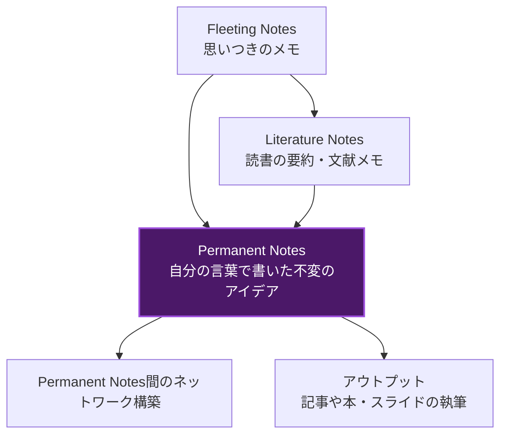
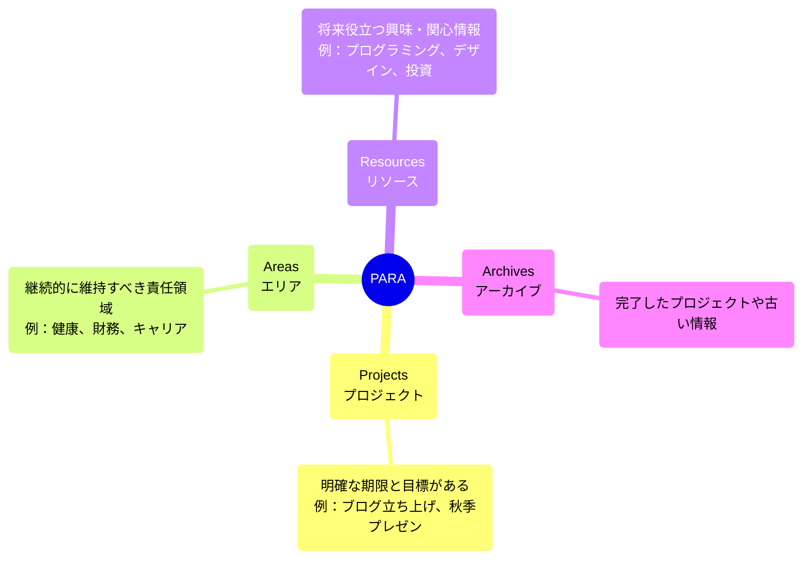
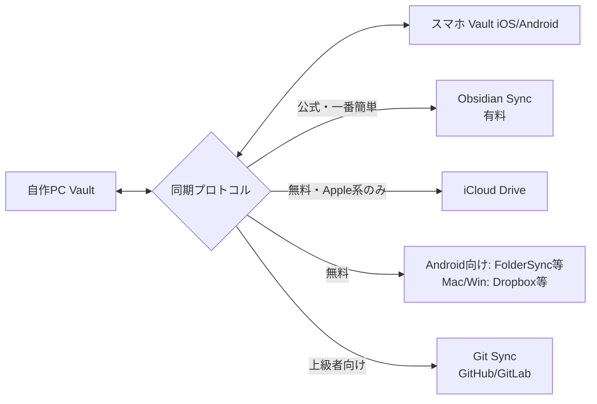

# Obsidian 完全攻略ガイド (The Ultimate Obsidian Knowledge Base - V3)

Obsidian（オブシディアン）は、単なるメモアプリの枠を超えた「あなた専用の第2の脳（Second Brain）」を構築するための最強のナレッジマネジメントツールです。このガイドでは、Obsidianの基本から、Zettelkastenなどの高度なノート術、DataviewやTemplaterを駆使した自動化、プロパティの活用、Publishでの公開まで、初心者から上級者まで役立つ情報を完全網羅で解説します。

---

## 1. Obsidianの基本哲学とアーキテクチャ (Philosophies & Architecture)

### 1.1 Local-First (ローカルファースト)
Obsidianの最大の強みは「データが全てユーザーの手元にある」ことです。
- **Vault（保管庫）**: Obsidianにおける最上位のフォルダ構造です。PCやスマホのローカルストレージにある単なるフォルダであり、その中のファイル群をObsidianが読み取って表示します。
- **データポータビリティ**: クラウドサービスのデータベースにロックイン（囲い込み）される心配がありません。サービスが終了しても、あなたのデータは手元に残り、未来永劫読み書きを続けることができます。

### 1.2 プレーンテキストとMarkdown (Markdown Syntax)
すべてのノートは拡張子 `.md`（プレーンテキスト）として保存されます。
Markdown（マークダウン）という記法を使うことで、テキストだけで美しい文書構造を表現できます。

**基本記法:**
- **見出し**: `# 大見出し`、`## 中見出し`、`### 小見出し`
- **装飾**: `**太字**`、`*斜体*`、`~~取り消し線~~`、`==ハイライト==`
- **リスト**: `- 箇条書き`、`1. 番号付きリスト`
- **引用**: `> 引用文`
- **コード**: \`バッククォート\` で囲むとインラインコード、3つで囲むとコードブロックになります。
- **チェックボックス**: `- [ ] 未完了`、`- [x] 完了`

### 1.3 リンクとネットワーク (Links & Graph View)
Obsidianは「ノートを繋げること」に特化しています。

- **内部リンク**: `[[ノート名]]` と記述するだけで、別のノートへリンクできます。双方向リンクが自動で形成されます。
- **バックリンク (Backlinks)**: 指定したノートが「どのノートからリンクされているか」を自動で表示します。これにより、予期せぬアイデアのつながりを発見できます。
- **未解決リンク**: まだ作成していないノートへのリンク（`[[未来のノート]]`）を作ることも可能です。クリックすると新規作成されます。
- **グラフビュー (Graph View)**: リンクされたノート群のつながりを、星座のようなネットワーク図で視覚化します。

---

## 2. メタデータとプロパティ (Properties & YAML Frontmatter)

Obsidian v1.4以降、ノートに「メタデータ」を付与する機能が強化され、プロパティ（Properties）として直感的に操作できるようになりました。

### 2.1 プロパティとは？
ノートの先頭に定義するデータのことです。作成日、作者、タグ、ステータスなどの属性情報をデータとして定義します。
```yaml
---
title: "プロパティの使い方"
date: 2024-03-01
tags: [obsidian, knowledge]
status: "in-progress"
rating: ★★★★
---
```
### 2.2 プロパティの種類 (Property Types)
- **Text**: 通常の文字列
- **List**: 複数の項目（タグなど）
- **Number**: 数値
- **Checkbox**: True/False（チェックボックス）
- **Date / Date & Time**: 日付や時間
- **Aliases**: これを設定すると、検索時やリンク作成時に別名（エイリアス）でそのノートをサジェストしてくれます。（例：`aliases: [オブシディアン]`）

---

## 3. フォルダ設計とノート分類メソッド (Organization Methods)

ノートをどのように整理すべきか、代表的な手法を図解します。

### 3.1 フォルダ vs タグ
- **フォルダ**: 排他的な分類。セキュリティ（公開・非公開）や絶対的なカテゴリ分けに向いています。
- **タグ**: 柔軟な分類。横断的な検索や状態管理（`#status/active`, `#todo`）に最適です。ネストタグ（階層化タグ）も使用できます。

### 3.2 Zettelkasten (ツェッテルカステン) メソッド
ドイツの社会学者ニクラス・ルーマンが実践した、アイデアをアトミック（最小単位）に分割し、網の目のようにリンクさせる手法。



### 3.3 PARA メソッド
情報を目的に応じて4つに分類する手法。



### 3.4 MOC (Map of Content) / LYT (Linking Your Thinking)
フォルダの階層に依存せず、関連するノートへのリンクをまとめた「インデックス（目次）ノート」を作成する、ハブ＆スポーク型の整理手法です。情報の森で迷子にならないための道標となります。

---

## 4. コアプラグイン徹底解説 (Core Plugins)

標準機能として内蔵されているが、デフォルトではオフになっているものも多い強力な機能群です。

- **デイリーノート (Daily Notes)**:
  「今日」のノートをワンクリックで作成します。日記、タスクログ、その日の出来事を全て放り込むInboxとして機能します。
- **キャンバス (Canvas)**:
  無限のホワイトボード機能です。ノート、画像、ウェブサイト、PDFをカードとして配置し、矢印でつなげることができます。マインドマップや複雑な概念の整理に極めて有用です。
- **テンプレート (Templates)**:
  定型的なMarkdown構造を瞬時に呼び出せます。デイリーノートのフォーマットなどに便利です。
- **コマンドパレット (Command Palette)**:
  `Cmd/Ctrl + P` で呼び出し、あらゆる操作をマウスなしで行えます。
- **ファイルリカバリー (File recovery)**:
  定期的にノートのスナップショットを自動保存します。誤削除してしまっても、数日前の状態に素早く復元できます。
- **ワークスペース (Workspaces)**:
  開いているタブの配置やパネルのレイアウトを保存し、いつでも一瞬で状態を復元できます。

---

## 5. 必須・最強コミュニティプラグイン (Essential Community Plugins)

世界中の開発者が作成した拡張機能です。「セーフモード」を解除することで導入できます。

### 5.1 Dataview (最強のデータベースプラグイン)
ノートのメタデータ（プロパティ）をSQLライクなクエリで検索し、動的なリストやテーブル、タスク一覧を生成します。

**例：未完了のタスクだけを抽出するDQL（Dataview Query Language）**
```dataview
task
where !completed
```

**例：評価の高い本のリストをテーブル表示**
```dataview
table author, rating, dateRead as "読了日"
from #book
where rating >= 4
sort rating desc
```

### 5.2 Templater (究極のテンプレートエンジン)
標準テンプレート機能を遥かに凌駕する強力なプラグインです。JavaScriptを実行できるため、動的な値の挿入が可能です。
- 今日から1週間後の日付を挿入: `<% tp.date.now("YYYY-MM-DD", 7) %>`
- 新規ファイル作成時に自動でカーソルを特定の位置に移動: `<% tp.file.cursor(1) %>`

### 5.3 Linter
コードのフォーマッター（PrettierやESLint）のように、ノート保存時にMarkdownの書式を自動整形します。見出しの前後の空行やリストのインデントを統一してくれます。

### 5.4 Omnisearch
Obsidian標準の検索機能を大幅に強化します。PDFファイルの中のテキストや、画像内の文字（OCR機能）まで爆速で全文検索できるようになります。

### 5.5 Excalidraw
手書き風の図面やフローチャート、ワイヤーフレームを手軽に描けるツールをObsidianに完全統合。描いた図の中にObsidianのノートへの内部リンクを埋め込めるのが最大の特徴です。

### 5.6 Kanban
TrelloのようなカンバンボードをMarkdownで実現します。タスクの進捗管理（Todo -> In Progress -> Done）を視覚的に行えます。

---

## 6. 同期・バックアップと公開 (Sync, Backup & Publish)

Obsidianのデータはローカルにあるため、複数の端末（PCとスマホなど）で共有するには同期の仕組みが必要です。



### 6.1 同期オプション (Sync Options)
- **Obsidian Sync (公式推奨)**: 月額有料サービス。エンドツーエンド暗号化で即座に同期され、最大1年間のバージョン履歴を無制限に保持します。設定やプラグインも同期可能です。
- **iCloud Drive**: MacとiPhone間で無料で同期できます。ただしApple側の同期遅延による「ファイルの重複」が起こりやすい点に注意が必要です。
- **Obsidian Git**: `Git` を用いてGitHubなどに自動コミット＆プッシュを行います。PC間での同期に最強ですが、スマホからの利用（特にiOS）は難易度が高いです。

### 6.2 Obsidian Publish (ノートの公開設定)
自分が書いたノート群を、一瞬で個人のウェブサイト・Wikiとして全世界に公開できる公式有料サービスです。
- パスワード保護、カスタムドメイン対応。
- グラフィカルなつながり（グラフビュー）もWeb上で再現されます。
- 個人ブログ、プロジェクトのドキュメンテーション、公開用ポートフォリオとして活用されています。

---

## 7. カスタマイズとUIの美化 (Customization & Themes)

### 7.1 コミュニティテーマ (Themes)
Obsidianの外観はCSSで完全にカスタマイズ可能です。
- **Minimal**: 世界で最も人気のあるテーマ。装飾を削ぎ落とし執筆に集中できます。"Minimal Theme Settings"プラグインと併用することで、細かな色や挙動を調整できます。
- **Things**: Macの人気タスクアプリに似た、クリーンで洗練されたテーマ。
- **AnuPpuccin / Catppuccin**: パステルカラーを基調とした、目に優しく美しいテーマ。

### 7.2 CSS Snippets (CSSスニペット)
特定の要素（例：見出しの一部の色、チェックボックスのデザインなど）だけを変更したい場合、`.obsidian/snippets` フォルダにCSSファイルを作成することで部分的な上書きが行えます。

---

## 8. トラブルシューティングとパフォーマンス (Troubleshooting & Performance)

### 8.1 アプリの動作が重い・カクつく
- **原因の切り分け**:  キーボードから `Cmd/Ctrl + P` で「Show debug info（デバッグ情報を表示）」を起動し、起動にかかっている時間をチェックします。
- **Dataviewの多用**: 非常に複雑なDataviewクエリを大量のノートで実行すると、動作が重くなります。クエリの最適化（`WHERE`で絞り込みを早く行う）を検討してください。
- **セーフモード**: プラグインが原因か特定するため、一度「セーフモード」をオンにして再起動し、動作を確認してください。

### 8.2 iCloudでノートが複製・重複する (`ノート名 1.md`)
- **対策**: Macの「システム設定」>「Apple ID」>「iCloud」において、「Macストレージを最適化」のチェックを**外します**。これにより、ファイルがクラウド上から消えてオフラインになるのを防ぎます。問題が頻発する場合はObsidian Syncの利用を検討してください。

### 8.3 文字化けや文字が入力できない
- **対策**: コミュニティプラグイン（特にVimモード系や、入力補助系プラグイン）が干渉している場合が多いです。怪しいものを一つずつオフにして検証します。
