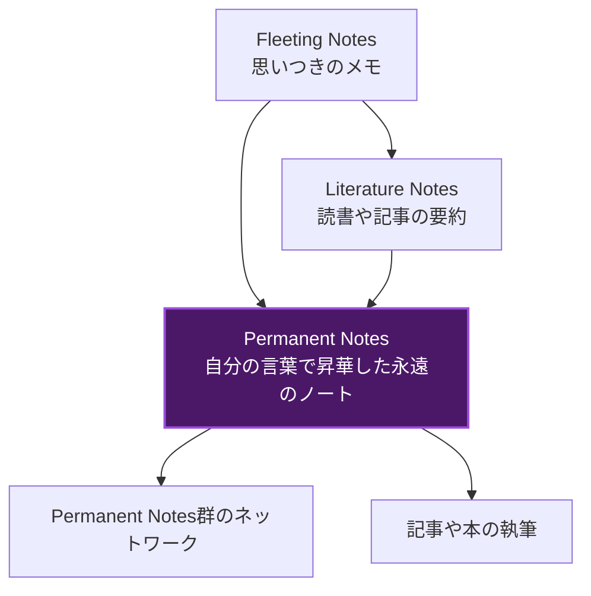
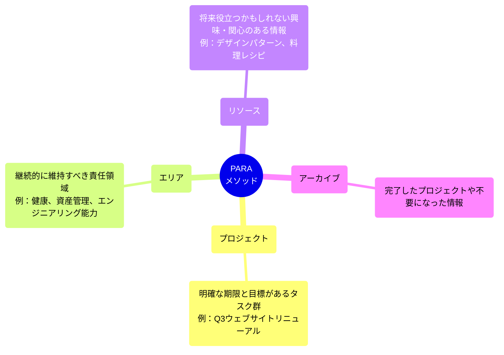
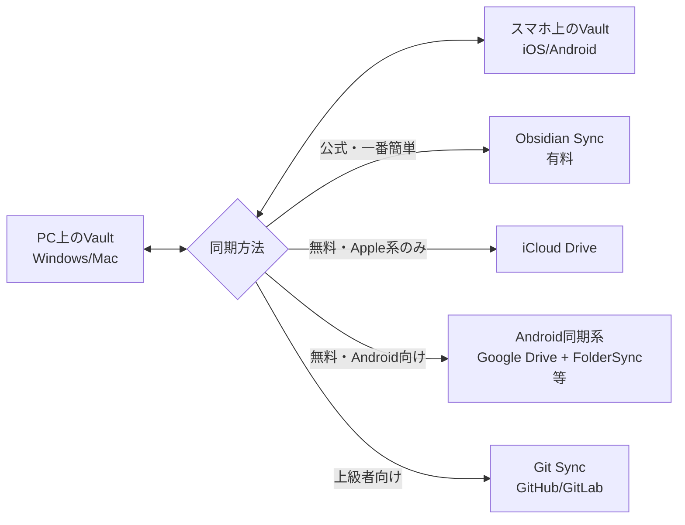

# Obsidian 完全攻略ガイド (The Ultimate Obsidian Knowledge Base)

Obsidianは単なるメモアプリではありません。これは「あなた専用の第2の脳（Second Brain）」を構築するための強力なツールです。このガイドでは、Obsidianの基本から、Zettelkastenなどの高度なノート術、Dataviewなどの必須プラグインまで、完全網羅で解説します。

---

## 1. Obsidianの基本と概念 (Obsidian Basics & Concepts)

### 1.1 Vault（保管庫）とは何か？なぜWordやEvernoteではないのか？
- **Vault（保管庫）とは**: Obsidianにおける最上位のフォルダ構造です。すべてのノートや画像、設定ファイルがこのフォルダ内に保存されます。クラウド上のブラックボックスに保存されるわけではなく、あなたのPC上の「ただのフォルダ」です。
- **なぜObsidianなのか？（Local-Firstの強み）**: EvernoteやNotionとは異なり、データはすべてあなたのPCのローカル環境にプレーンテキスト（後述）として保存されます。サービスが終了しても、オフライン環境でも、データが失われることは絶対にありません。
- **プレーンテキストの魔法**: ノートは拡張子 `.md` のテキストファイルです。専用ソフトがなくても、最悪Windowsの「メモ帳」で開くことができます。未来永劫読めるデータ形式です。

### 1.2 マークダウン記法 (Markdown Syntax) 入門
Obsidianはマークダウンという軽量なマークアップ言語で記述します。文章を書きながら、記号を使って装飾や構造化を行います。
- **見出し**: `# 見出し1`、`## 見出し2` のように `#` の数で階層を表現します。
- **文字装飾**: `**太字**`、`*斜体*`、`~~取り消し線~~`、`==ハイライト==`。
- **リスト**: `- リスト項目` で箇条書き、`1. 番号付きリスト` で順序リストになります。
- **引用**: `> 引用文` で引用ブロックを作成します。
- **コード**: \`バッククォート\` で囲むとインラインコード、3つで囲むとコードブロックになります。

### 1.3 リンクとネットワーク (Links & Graph)
Obsidianの最大の特徴はノート同士を「リンク」できることです。
- **内部リンク**: `[[ノートのタイトル]]` と[と]を2回打つだけで、別のノートへのリンクが張れます。
- **バックリンク**: ノートAからノートBへリンクを張ると、ノートBの画面下部に「ノートAからリンクされていますよ」という情報（バックリンク）が自動で表示されます。
- **グラフビュー**: リンクされたノート同士のつながりを、星座のようなネットワーク図として視覚化できます。これにより、思いがけないアイデアの結合が生まれます。

---

## 2. フォルダ設計とノート分類 (Folder Design & Note Classification)

ノートが増えてきたとき、どのように整理すべきでしょうか？代表的な3つの手法を図解で解説します。

### 2.1 フォルダ vs タグ
- **フォルダ**: 排他的な分類（1つのファイルは1つのフォルダにしか属せない）に向いています。（例：`10_Projects`、`20_Areas`）
- **タグ（`#`）**: 柔軟な分類（1つのファイルに複数のタグをつけられる）に向いています。状態管理（`#todo`, `#in-progress`）やカテゴリの横断的な検索に有用です。ネストタグ（`#tech/python`）も使用可能です。

### 2.2 Zettelkasten（ツェッテルカステン）メソッド
1つのノートには1つのアイデアだけを書く（アトミック性）、ノート同士を密にリンクさせる手法です。

### 2.3 PARAメソッド
Tiago Forte氏が提唱した、情報を行動に移すためのフォルダ構造です。

### 2.4 MOC (Map of Content)法
フォルダの階層構造に頼らず、関連するノートへのリンクを1つの「目次ノート」にまとめるハブ＆スポーク型の整理手法です。

1. `Index.md` (最上位MOC)
2. `[[Programming MOC]]`、`[[Health MOC]]`をIndexにリンク
3. 各MOCの中に、具体的なノートへのリンクを多数配置する

---

## 3. コアプラグイン・必須機能 (Core Plugins & Essential Features)

標準搭載されている重要な機能をオンにすることで、効率が劇的に変わります。「設定」>「コアプラグイン」から有効化します。

- **デイリーノート (Daily Notes)**: ボタン1つで「今日の日付.md」を作成します。日報や思いつきをとりあえず書き込む「inbox（受信箱）」として最適です。
- **テンプレート (Templates)**: 定型文をワンクリックで挿入できます。議事録のフォーマットやデイリーノートの雛形によく使われます。
- **ファイルリカバリー (File recovery)**: システムが数分おきにノートのスナップショットを自動保存します。誤って文章を全消ししてしまっても、「設定」>「ファイルリカバリー」から過去のバージョンを復元できます。（デフォルト7日間保存）
- **コマンドパレット (Command palette)**: `Cmd/Ctrl + P` で呼び出し、あらゆる操作をキーボードだけで実行できる機能です。
- **キャンバス (Canvas)**: ノート、画像、PDF、ウェブ画面などを2Dの無限のホワイトボード上に配置し、矢印でつなげる視覚的思考ツールです。マインドマップや相関図の作成に最適です。

---

## 4. 最強のコミュニティプラグイン (Ultimate Community Plugins)

Obsidianの真の力は、世界中の開発者が作る「コミュニティプラグイン」にあります。（設定 > コミュニティプラグイン > セーフモードを解除してインストール）

### 4.1 Dataview（データビュー）
ノートのメタデータ（タグやプロパティ）をデータベースのように検索し、表やリストで自動出力できる魔法のプラグインです。これをマスターすると、最強のタスク管理・Wikiツールになります。

**例：`#book` タグがついたノートを一覧表示し、著者(author)と評価(rating)も表示するコード**
\`\`\`dataview
table author, rating
from #book
sort rating desc
\`\`\`

### 4.2 Templater（テンプレーター）
コアプラグインの「テンプレート」の上位互換です。現在の日付や時間を自動挿入したり、JavaScriptを実行して動的なテンプレートを作ることができます。
- よく使う構文：`<% tp.file.title %>`（現在のファイル名を自動入力）
- `<% tp.date.now("YYYY-MM-DD") %>`（今日の日付を自動入力）

### 4.3 Advanced Tables
マークダウンの表作成は少し面倒ですが、このプラグインを入れるとExcelやスプレッドシートのようにエンターキーとTabキーだけで表が自動フォーマットされ、計算式の挿入まで可能になります。

### 4.4 Excalidraw
手書き風の図やフローチャートを描ける有名なツール「Excalidraw」をObsidian内で完全に動かせるプラグイン。描いた図の中にObsidianのノートへの内部リンクを埋め込めるのが最大の特徴です。

---

## 5. 同期とバックアップ (Syncing & Backup)

Obsidianのノートはただのローカルファイルなので、スマホとPC間で同期するには仕組みが必要です。

- **Obsidian Sync (公式・有料)**: 最も簡単で確実な方法です。数ドルの月額料金がかかりますが、iOS/Android/PC間の同期がエンドツーエンド暗号化で一瞬で行われます。バージョン履歴の無制限保存も利用できます。
- **iCloud Drive (無料・Apple推奨)**: MacとiPhone/iPadを使っているなら、VaultをiCloud Drive上に作成するだけで無料で同期完了します。（WindowsでもiCloudソフトを入れれば可能ですが、エラーが起きやすい傾向にあります）
- **Git Sync (無料・上級者プログラマー向け)**: 『Obsidian Git』プラグインを使い、設定した時間ごとに自動でGitHubにCommitとPushを行います。完全無料で強力なバージョン管理が手に入りますが、スマホ（特にiOS）からの利用難易度が高いのが難点です。

---

## 6. カスタマイズと美化 (Customization & Beautification)

毎日使うツールだからこそ、見た目を自分好みにすることはモチベーション維持に直結します。

### 6.1 テーマ (Themes)
「設定」>「外観」>「テーマ」からコミュニティテーマをインストールできます。
- **Minimal**: 世界で一番有名なテーマ。極限まで装飾を削ぎ落とし、執筆に集中できます。「Minimal Theme Settings」プラグインと併用するとさらに細かく設定可能です。
- **Things**: Macの人気タスク管理アプリ「Things 3」に似た、美しくクリーンなデザイン。
- **Catppuccin**: パステルカラーを基調とした、目に優しくかわいらしいダークテーマ。

### 6.2 CSSスニペット (CSS Snippets)
外観の一部だけを微調整したい場合に使います。`.obsidian/snippets` フォルダ内に `.css` ファイルを配置し、設定から有効化します。見出しの色だけを変えたり、チェックボックスのデザインをカスタマイズできます。

---

## 7. トラブルシューティングとFAQ (Troubleshooting & FAQs)

### 7.1 iCloudでiPhoneと同期するとファイルが重複する・消える
**症状**: `ノート名 1.md` のように意図しない複製ファイルが大量に生成される。
**解決策**: AppleのiCloudサーバー側の同期の遅延が原因です。「MacのiCloud設定で『Macストレージの最適化』をオフにする」「iOSの設定でObsidianアプリの自動バックグラウンド更新とiCloud Driveの同期を安定したWiFi下で行う」ことで改善することが多いです。重症な場合はObsidian Syncの利用を強く推奨します。

### 7.2 プラグインを入れたら動作が重くなった
**症状**: アプリの起動が遅い、文字入力がカクつく。
**解決策**: `Cmd/Ctrl + P` で「Show debug info（デバッグ情報を表示）」を実行し、読み込まれている不要な機能をチェックします。特に、非常に大規模なVaultにおいて「Dataview」で複雑なクエリ（テーブル）を多用すると重くなります。また、一度プラグインをすべてオフにする「セーフモード」をオンにして再起動し、問題がプラグインにあるのかコアにあるのかを切り分けてください。
